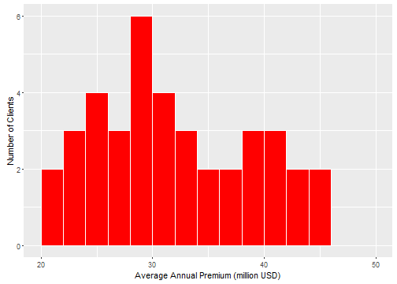

## Introduction

The Worker's Compensation Insurance Client Segmentation App is created using the Workers Compensation data from the CRAN insuranceData package.

#### Key Features

1. Allows exploration of multiple year insurance premium and loss data for multiple clients
2. Modifies input data to make it more client specific
3. Computes additional data parameters that would allow evaluation of clients viz.
    - Average Annual Premium
    - Overall Loss Ratio Percentage
    - Selected Period Loss Ratio Percentage
5. Allows client segmentation based on the above data parameters using k-means clustering
6. Allows flexibility to users for segmenting the data by a number of parameters

--- .class #id

## Input Data

The input data used for developing the App is the Worker's Compensation insurance data available from CRAN insuranceData package.

The data has 847 rows and 4 colums representing premium and loss data specific to 121 clients for 7 years. The data fields representing Client, Year, Premium and Loss are CL, YR, PR, LOSS. 

The computed client specific data parameters available to users for segmenting the data are:
- Average Annual Premium - Total Premium averaged over 7 years
- Total Loss - Total loss summed up for 7 years
- Overall Loss Ratio - Total loss divided by Total Premium (across 7 years)
- Selected Period Loss Ratio - Loss Ratio for selected period of years

--- .class #id

## Output Plot - Histogram

The outputs from the App include Histgrams for two computed data parameters viz. Average Annual Premium and Overall Loss Ratio Percentage by Cient. 

The Histogram for Average Annual Premium values of all the clients is as shown below:

--- .class #id

## Output Plot - k-means clusters
Among the key outputs from the App are the plots displaying k-means clusters for the subset data defined by the users. 
The users have the flexibility to subset the data with the help of input widgets specific to data ranges of Average Annual Premium, Number years in consideration, Overall Loss Ratio and Loss Ratio for user-defined number of years. 

A sample plot displaying five k-means clusters when data for all 121 clients are considered is as below:

